# Хеш-таблица: практическое применение и оптимизация

В этой статье мы определим что такое хеш-таблица, исследуем некоторые аспекты, связанные с ее реализацией, применим данную структуру данных для решения практической задачи и попытаемся ее оптимизировать.

## Содержание 

[ВСТУПЛЕНИЕ](#вступление "Вступление")

[- Постановка простейшей задачи об именах и квартирах](#постановка-простейшей-задачи-об-именах-и-квартирах "Постановка простейшей задачи об именах и квартирах")

[- Создание хеш-таблицы для решения задачи в обратную сторону](#создание-хеш-таблицы-для-решения-задачи-в-обратную-сторону "Создание хеш-таблицы для решения задачи в обратную сторону")

[- Возникновение коллизий и их разрешение методом цепочек](#возникновение-коллизий-и-их-разрешение-методом-цепочек "Возникновение коллизий и их разрешение методом цепочек")

[- Как улучшить хеш-таблицу](#как-улучшить-хеш-таблицу "Как улучшить хеш-таблицу")

[ИССЛЕДОВАНИЕ ХЕШ-ФУНКЦИЙ](#исследование-хеш-функций "Исследование хеш-функций")

[- Основные характеристики хеш-функций](#основные-характеристики-хеш-функций "Основные характеристики хеш-функций")

[- Методика тестирования](#методика-тестирования "Методика тестирования")

[- Список исследуемых хеш-функций](#список-исследуемых-хеш-функций "Список исследуемых хеш-функций")

[- Результаты тестирования](#результаты-тестирования "Результаты тестирования")

[- Вывод](#вывод "Вывод")

[CОЗДАНИЕ АНГЛО-РУССКОГО ПЕРЕВОДЧИКА](#создание-англо-русского-переводчика "Создание англо-русского переводчика")

[ОПТИМИЗАЦИЯ](#оптимизация "Оптимизация")

[ЗАКЛЮЧЕНИЕ](#заключение "Заключение")

## Вступление

В программировании мы часто имеем необходимость хранить некоторые данные с возможностью обратиться к ним. К примеру, используя массивы, мы можем помещать в ячейки памяти некоторую информацию, которая затем доступна для прочтения при обращении к этим ячейкам по их адресам.

### Постановка простейшей задачи об именах и квартирах

Проиллюстрируем работу с массивом следующей несложной задачей. Пусть в некотором доме живут несколько ребят: Аня, Коля и Сережа. Семьи каждого из них имеют свои квартиры, у которых есть целочисленные положительные номера. Допустим, Аня живет в квартире №2, Коля - в квартире №7 и Сережа - квартире №5. В остальных квартирах живут незнакомые нам люди. Мы хотим иметь возможность по номеру квартиры узнать, кто там живет.

Для решения этой задачи мы можем завести массив строк, в N-ой ячейке которого будет храниться имя ребенка, который живет в квартире с номером N. Визуально структуру такого массива можно будет представить следующим образом:

Теперь, если мы хотим узнать, кто живет в какой-нибудь квартире, нам достаточно взять строку из ячейки с номером, равным номеру интересующей нас квартиры. В этой строке будет либо имя проживающего в ней,  либо она будет пустой, если в выбранной квартире живут незнакомцы.

Таким образом, построенный нами массив имеет информацию о парах *(номер квартиры - имя)* - зная первое, мы легко можем узнать второе. В общем случае в информатике такие пары имеют вид *(ключ - значение)*, где ключ - некоторый уникальный идентификатор, а значение - связанные с этим идентификатором данные. 

### Создание хеш-таблицы для решения задачи в обратную сторону

Но можно ли решить поставленную задачу в обратную сторону: построить такой массив, с помощью которого мы сможем по имени узнавать, в какой квартире он или она живет?

В данном случае мы сталкиваемся с проблемой: имена ребят нельзя использовать в качестве номеров ячеек массива, так как они являются наборами букв, а не натуральными числами. Однако мы можем использовать в качестве номеров ячеек не сами имена, а некоторую информацию о них, например, количество букв в каждом имени.

Давайте напишем функцию (назовем ее *hash*), которая принимает в качестве аргумента строку, а возвращает ее длину (например, *hash("Привет") = 6*). Теперь, если мы хотим узнать, где живет человек с некоторым именем *name*, мы вызовем *hash(name)* и полученное значение будем использовать как номер ячейки, в котором лежит номер квартиры человека с именем *name*. Теперь наш массив будет выглядеть следующем образом:

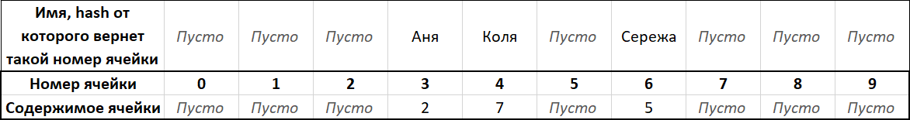

Таким образом, мы получили структуру данных, называемую **хеш-таблицей**. Она позволяет нам эффективно (то есть без необходимости полного перебора всего объема данных) получать некоторое значение (в данном случае номер квартиры) по ключу (в данном случае по имени). Функция *hash* в свою очередь называется **хеш-функцией**. Любая такая функция преобразует набор данных (в данном случае строку из букв) в некоторое конечное значение (в данном случае в натуральное число равное длине строки).

### Возникновение коллизий и их разрешение методом цепочек

Предположим, что мы познакомились еще с тремя ребятами. Их зовут Вова, Саша и Маша, а живут они в 6, 9 и 1 квартирах соответственно. Мы хотим добавить информацию о них в нашу хеш-таблицу, но есть одна проблема: длина имен Коли, Вовы, Саши и Машы равны, вследствие чего *hash("Коля")=hash("Вова")=hash("Саша ")=hash("Маша")=4*. Ситуации, когда хеш-функция выдает одно и то же значение при обработке разных ключей, называется **коллизия**.

Поскольку мы не можем положить более одного значения в одну ячейку массива, мы должны придумать способ разрешать коллизии. Существует много различных методов для решения этой задачи, но мы остановимся лишь на одном из них: разрешение коллизий с помощью **метода цепочек**.

Идея данного решения заключается в том, что вместо отдельных значений мы можем класть в ячейки массива набор пар *(ключ-значение)*. Набор может быть реализован разными способами, в том числе в виде обычного [связного списка](https://ru.wikipedia.org/wiki/%D0%A1%D0%B2%D1%8F%D0%B7%D0%BD%D1%8B%D0%B9_%D1%81%D0%BF%D0%B8%D1%81%D0%BE%D0%BA "Связный список (Википедия)"). После добавления новых имен в нашу хеш-таблицу с использованием списков, ее можно будет схематически представить следующим образом:

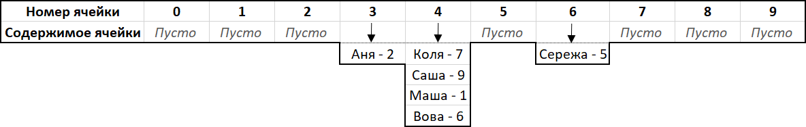

В качестве иллюстрации работы с такой структурой опишем последовательность действий, которая необходима чтобы узнать номер квартиры, в которой проживает, например, Маша:

1. Вызываем *hash("Маша")*, берем полученное значение (оно будет равно четырем), и рассматриваем соответственную ячейку массива (под номером четыре).
2. В четвертой ячейке находится список из нескольких пар *(ключ-значение)*. Начинаем их перебирать, пока не дойдем до пары, в которой ключем является "Маша".
3. Найдя пару с ключем "Маша", берем его значение. Им оказывается единица.

Таким образом мы получили информацию о том, что Маша живет в квартире №1.

### Как улучшить хеш-таблицу

Как вы наверное заметили, данные в хеш-таблице распределены неравномерно: пока одни ячейки пустуют, в других появляются значительные коллизии. В данном случае это связано в первую очередь с неудачным выбором хеш-функции, ведь многие имена имеют длины, принадлежащие узкому диапазону значений. Было бы значительно лучше, если бы при обработке имени учитывалось не только его длина, но и информация о буквах в нем, их расположение и т. д.

Но какую именно хеш-функцию лучше всего выбрать? Ответом на этот вопрос является исследование, которое будет подробно описано в следующей главе.

## Исследование хеш-функций

Целью данного исследования является тестирование различных хеш-функций для строк, содержащих английский текст, на большом объеме данных, получение их характеристических параметров и заключение об их пригодности для использования при решении реальных практических задач на основании информации, добытой в ходе работы.

### Основные характеристики хеш-функций

Прежде всего необходимо обозначить, какие характеристики являются наиболее критическими при исследовании работоспособности хеш-функций. В данной работе наибольшее внимание будет уделено следующим показателям: 

* **Дисперсия количества коллизий при разных размерах хеш-функций**. Отражает равномерность распределения коллизий в хеш-таблице при использовании данной хеш-функции. Является наиболее приоритетным параметром.
* **Максимальное и минимальное количество коллизий в одной ячейке.** Эти параметры помогают выявить участки с неравномерным распределением элементов в хеш-таблице, которые в силу особенностей расчета дисперсии не были отражены в ее показателях.
* **Время работы хеш-функции.** Это значение является ключевым при выборе из нескольких хеш-функций, обладающих близкими значениями дисперсии и других показателей равномерности.
* **Масштабируемость.** Относительная величина, отражающая способность функции сохранять свои свойства на массивах разной длинны. 

*Примечание:* Дисперсией в дальнейшем будем называть величину, численно равную кубическому корню из определённого числа, посчитанного по следующему алгоритму: во время прохода по массиву находится квадрат разности частного количества объектов в хеш-таблице и длинны массива и количества коллизий в данной ячейке. Таким образом, значение дисперсии прямо пропорционально "неравномерности" распределения коллизий по ячейкам. В случае идеальной хеш функции значение дисперсии будет строго равно нулю. В случае малейшего отклонения от полной равномерности ее значение будет увеличиваться по мене увеличения разницы коллизий в различных ячейках. Таким образом, мы может использовать понятие дисперсии для характеристики качества работы хеш-функции на хеш-таблице с заданным массивом.

*Примечание:* Масштабируемостью в дальнейшем будем называть относительную величину, отражающую отношение динамики изменения дисперсии к динамике изменения размера массива, на котором происходит тестирование хеш-функции. Этот параметр рассчитывается следующим образом: на каждом этапе тестирования на некотором массиве с некоторой длинной, мы будем прибавлять к изначально нулевой переменной масштабируемости значение, равное модулю разности кубического корня частного длин массивов текущей и предыдущей итераций тестирования и частного значений дисперсий коллизий в текущей и предыдущей итерациях.

### Методика тестирования

Каждая функция по-очереди будет протестирована на множестве из 20 тысяч английских слов, наиболее часто встречающихся в английском языке. Полученные значения хеш-функций будут использоваться для получения числа коллизий, которые будут вызваны этими функциями на массивах длинной 7, 17, 29, 41, 101, 107, 1949 и 9973 элементов. 

На основании полученных данных будут построены диаграммы для визуализации результатов исследования и сделаны содержательные выводы.

### Список исследуемых хеш-функций

* **Константная хеш-функция**. Возвращает всегда фиксированное значение независимо от обрабатываемого ключа (в данном случае реализации ноль). Эзотерическая функция, которая заведомо неработоспособна, однако может использоваться для сравнения с остальными.
* **Хеш-функция длины строки.** Возвращает длину слова.
* **Хеш-функция первой буквы.** Возвращает ASCII-код первой буквы в слове.
* **Хеш-функция суммы кодов.** Возвращает сумму ASCII-кодов букв в слове. Как говорили в своей известной книге Керниган и Ритчи, *«Это не самый лучший алгоритм, но его достоинство заключаются в крайней простоте»*.
* **Битовый сдвиг влево.** Основан на битовом сдвиге влево и операции `xor`.
* **Хеш-функция суммы кодов с учетом позиции.** Возвращает сумму ASCII-кодов букв в слове, умноженных на номер буквы в слове.
* **Хеш Дженкинса (Jenkins hash).** Хеш-функция, разработанная Бобом Дженкинсом и впервые описанная в 1997 году.
* **DBJ2.** Хеш-функция, разработанная Даниэлем Юлиусом Бернштейном, который использует псевдоним "dbj".
* **SDBM.** Хеш-функция, созданная для открытой библиотеки New Database Manager.
* **Рандомная хеш-функция.** Авторская хеш-функция, делающая ряд математических операций, не обусловленных какими-либо строгими закономерностями или целями.
* **Хеш-функция 26-системы счисления.** Авторская хеш-функция, переводящая строку как 26-ичное число в десятичную систему счисления.

### Результаты тестирования

Рассмотрим результаты тестирования и охарактеризуем каждую функцию по отдельности. Далее идут названия функций, свод их показателей, графики распределения коллизий и краткое заключение.

#### Константная хеш-функция

|              Параметр               |      Значение       |
| :---------------------------------: | :-----------------: |
|              Дисперсия              |   **1924.3**20628   |
| Максимальные и минимальные коллизии | (20000 - 0) = 20000 |
|          Время работы (ms)          |          1          |
|          Масштабируемость           |    **0.09**5561     |

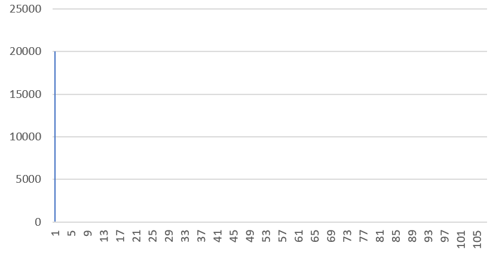

Очевидно, что данная хеш-функция не имеет практического смысла и заведомо сводит хеш-таблицу к списку с линейным временем поиска какого-либо элемента.

#### Хеш-функция длины строки

|              Параметр               |     Значение      |
| :---------------------------------: | :---------------: |
|              Дисперсия              |  **607.9**35322   |
| Максимальные и минимальные коллизии | (2943 - 0) = 2943 |
|          Время работы (ms)          |         8         |
|          Масштабируемость           |   **4.89**8221    |

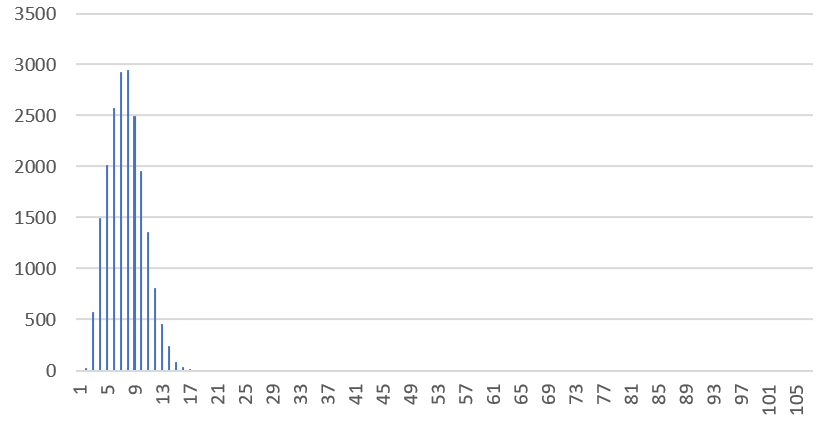

Мы уже рассматривали эту хеш-функцию во вступлении, и теперь снова убеждаемся в том, что на практике она слабо применима, так как длины подавляющего большинства английских слов лежат в узком диапазоне.

#### Хеш-функция первой буквы

|              Параметр               |     Значение      |
| :---------------------------------: | :---------------: |
|              Дисперсия              |  **429.1**04208   |
| Максимальные и минимальные коллизии | (2110 - 0) = 2110 |
|          Время работы (ms)          |         2         |
|          Масштабируемость           |   **1.75**1431    |

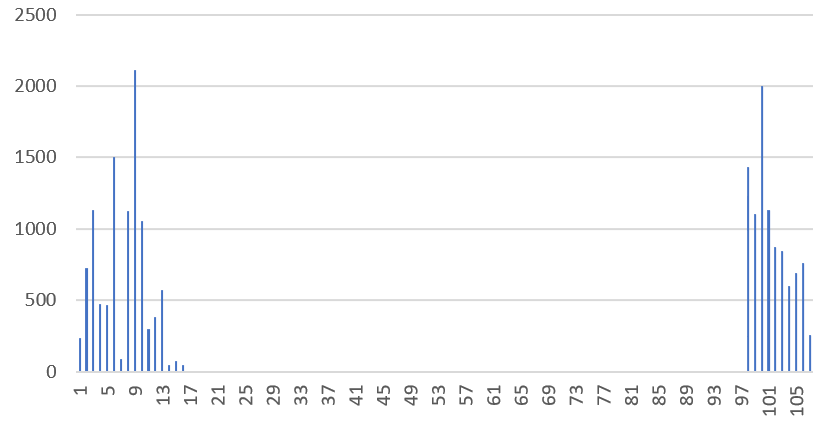

Давайте рассмотрим распределение на массиве большего значения:

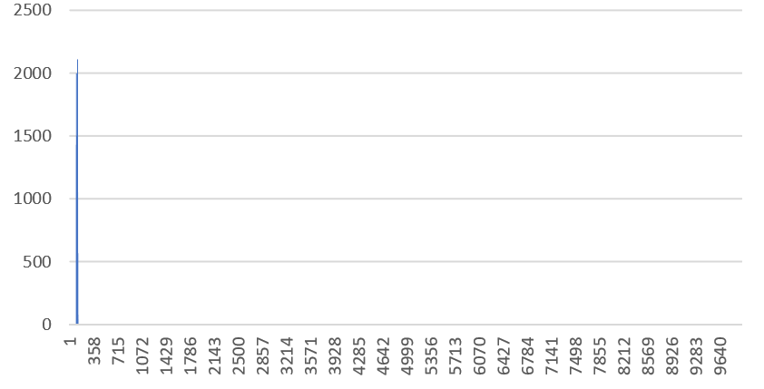

Мы снова получили неравномерное распределение, так как ASCII-коды английских букв лежат в интервале от 97 до 112. Учитывая также тот факт, что некоторые буквы встречаются чаще остальных в качестве первых букв слов (это хорошо демонстрирует первый график), на практике такая функция дает недопустимое количество коллизий.

#### Хеш-функция суммы кодов

|              Параметр               |    Значение    |
| :---------------------------------: | :------------: |
|              Дисперсия              | **170.0**52028 |
| Максимальные и минимальные коллизии | (551- 2) = 549 |
|          Время работы (ms)          |       18       |
|          Масштабируемость           | **14.62**4572  |

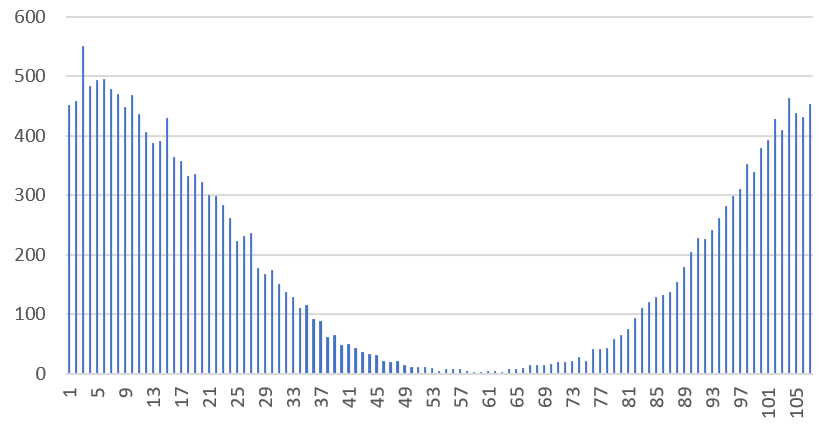

Более показательную картину мы может увидеть на большем массиве:

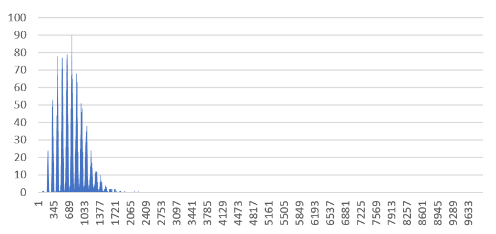

Как уже было сказано, ASCII-коды английских букв принадлежат диапазону, длина которого равна 26. Как следствие, при суммировании кодов букв на графике образуются характерные пики, которые соответствуют участкам с номерами, наиболее вероятно получающимися при суммировании нескольких букв. Понятно, что такое распределение является крайне не равномерным на массивах значительно длинны. 

#### Битовый сдвиг влево

|              Параметр               |    Значение     |
| :---------------------------------: | :-------------: |
|              Дисперсия              | **244.2**15262  |
| Максимальные и минимальные коллизии | (666 - 0) = 666 |
|          Время работы (ms)          |       10        |
|          Масштабируемость           |  **4.10**7862   |

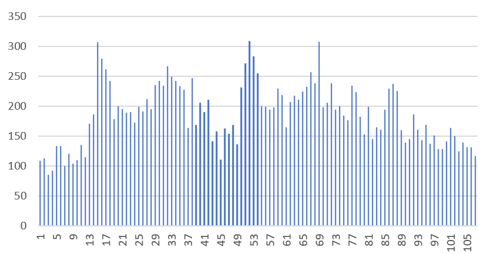

Если ориентироваться исключительно на зрительный анализ графика, то может показаться, что он обладает удовлетворительной равномерностью распределения. Однако весьма высокая дисперсия говорит нам об обратном, в чем мы можем легко убедиться, снова взяв больший размер массива:

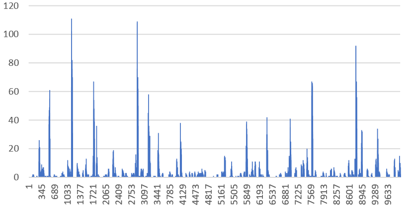

Мы видим довольно много хаотично расположенных пик. Коллизии в этих местах происходят слишком часто, что делает использование данной хеш-функции не очень рациональным.

#### Хеш-функция суммы кодов с учетом позиции

|              Параметр               |     Значение     |
| :---------------------------------: | :--------------: |
|              Дисперсия              |  **17.2**98659   |
| Максимальные и минимальные коллизии | (223 - 150) = 73 |
|          Время работы (ms)          |        30        |
|          Масштабируемость           |   **6.37**7997   |

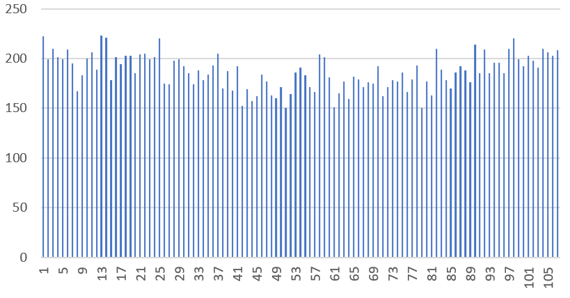

Посмотрим на это распределение в большем масштабе:

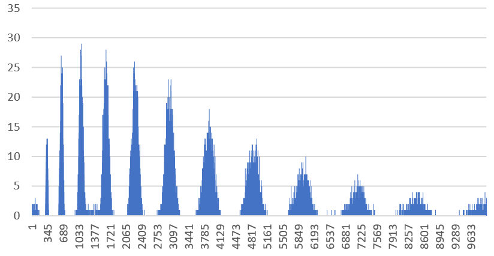

Можно провести аналогию между полученным распределением и распределением, полученным при помощи хеш-функция суммы кодов. Однако в этом случае пики стали более пологими, а расстояние между ними значительно возросло. Тем не менее, вкупе с медленной скоростью работы, пригодность данной хеш-функции весьма сомнительна.

#### Хеш Дженкинса (Jenkins hash)

|              Параметр               |     Значение     |
| :---------------------------------: | :--------------: |
|              Дисперсия              |  **12.4**89646   |
| Максимальные и минимальные коллизии | (214 - 149) = 65 |
|          Время работы (ms)          |        24        |
|          Масштабируемость           |   **1.23**7076   |

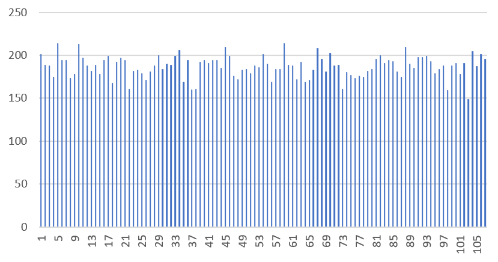

Мы получили весьма хорошее распределение, которое сохраняется при переходе на большие размеры таблицы:

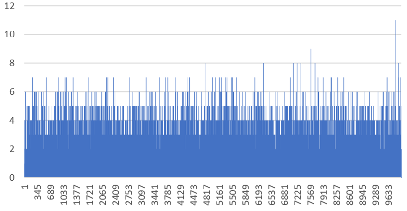

Данная хеш-функция известна как проверенный инструмент, который уже доказал свою свою эффективность в хешировании строк. Как мы видим, это первая функция из списка рассматриваемых функций, распределение которой не только имеет низкую дисперсию, но и ведет себя относительно стабильно на массивах разных размеров.

#### DBJ2

|              Параметр               |     Значение     |
| :---------------------------------: | :--------------: |
|              Дисперсия              |  **12.2**55483   |
| Максимальные и минимальные коллизии | (220 - 156) = 64 |
|          Время работы (ms)          |        20        |
|          Масштабируемость           |   **1.59**2371   |

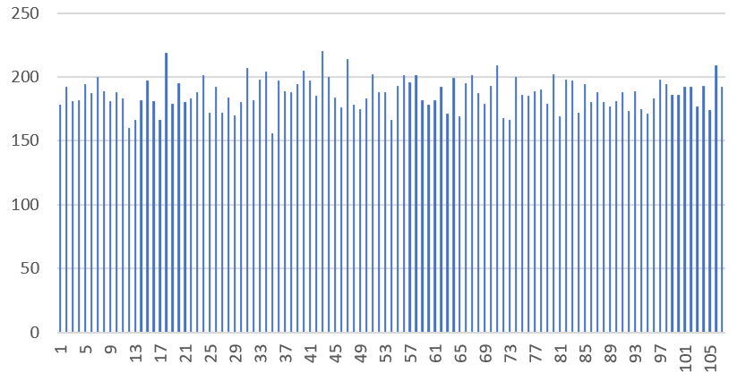

И на большем массиве:

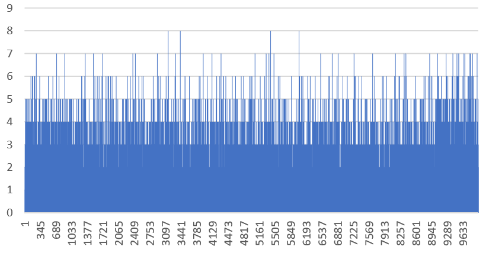

Характеристики данной функции по всем параметрам схожи с хеш-функцией Дженкинса, но в то же время незначительно эффективней по скорости исполнения. Мы можем запомнить данную функцию как возможный вариант для конечного выбора для применения.

#### SDBM

|              Параметр               |     Значение     |
| :---------------------------------: | :--------------: |
|              Дисперсия              |  **14.2**98900   |
| Максимальные и минимальные коллизии | (224 - 152) = 72 |
|          Время работы (ms)          |        22        |
|          Масштабируемость           |   **1.50**6558   |

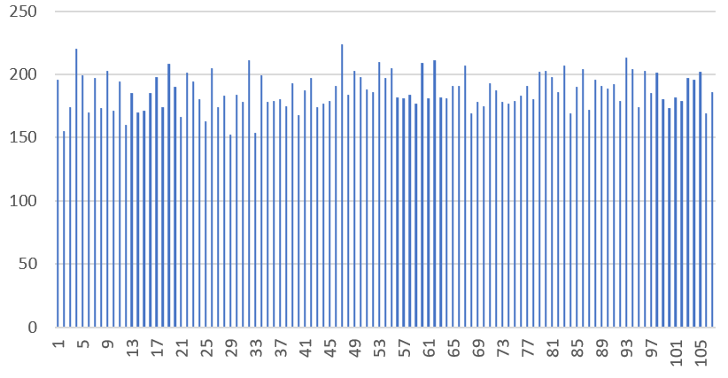

Снова проверяем распределение на более объемной хеш-таблице:

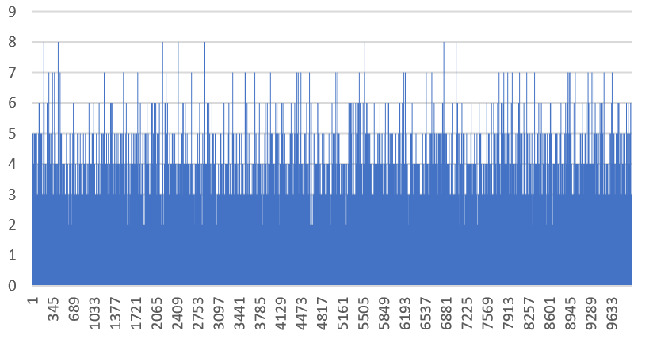

Данная хеш-функция работает хорошо, но по характеристикам чуть уступает двум предыдущим.

#### Рандомная хеш-функция

|              Параметр               |     Значение     |
| :---------------------------------: | :--------------: |
|              Дисперсия              |  **12.4**86653   |
| Максимальные и минимальные коллизии | (227 - 151) = 76 |
|          Время работы (ms)          |        24        |
|          Масштабируемость           |   **3.14**3266   |

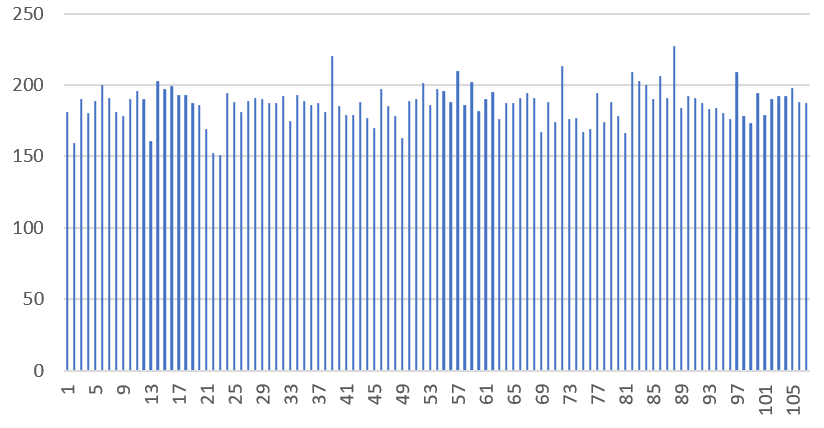

Как оказалось, на массиве небольшой длины рандомная хеш-функция дает весьма качественное распределение, что подтверждается низкой дисперсией. Однако при увеличении длины массива мы увидим области повышенной коллизии, которые можно зафиксировать даже невооруженным глазом:

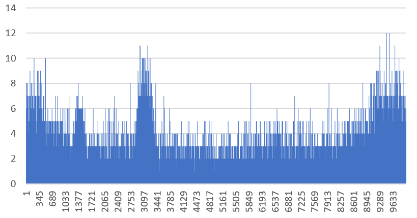

График имеет несколько хаотичных, относительно пологих пик со случайными возрастаниями в некоторых ячейках. Понятно, что не обусловленная никакими математическими закономерностями хеш-функция ведет себя непредсказуемо и может быть применима далеко не всегда.

#### Хеш-функция 26-системы счисления

|              Параметр               |     Значение     |
| :---------------------------------: | :--------------: |
|              Дисперсия              |  **11.6**93542   |
| Максимальные и минимальные коллизии | (213 - 163) = 50 |
|          Время работы (ms)          |        26        |
|          Масштабируемость           |   **2.70**5723   |

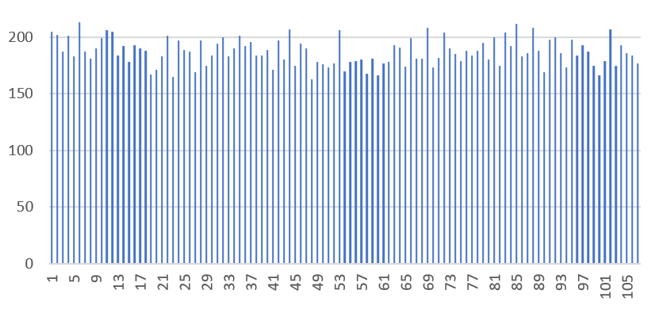

Проверим, какое распределение получается на массиве большего размера:

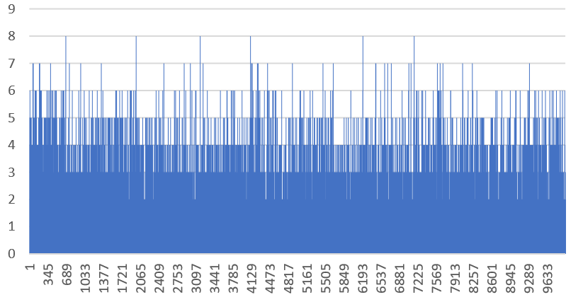

В целом мы получаем равномерное распределение коллизий, особенно на массиве малой длины, где дисперсия имеет наименьшее значение среди представленных хеш-функций. Однако на большем массиве мы не получаем особого преимущества, а время работы данный хеш-функции выше чем у большинства рассмотренных до этого.

#### Сравнение хеш-функций по дисперсии на массиве фиксированной длины, масштабируемости и времени работы

Приведем единую таблицу, в которой будут приведены все ранее описанные данные с точностью до значений, не подверженных искажениям из-за каких-либо погрешностей.

| Номер |             Название функции             | Дисперсия на массиве из 107 элементов | Время работы (в ms) при обработке 20 тысяч слов с точностью до 1 ms | Масштабируемость |
| :---: | :--------------------------------------: | :-----------------------------------: | :----------------------------------------------------------: | :--------------: |
|   1   |         Константная хеш-функция          |                1924.3                 |                              1                               |       0.09       |
|   2   |         Хеш-функция длины строки         |                 607.9                 |                              8                               |       4.89       |
|   3   |         Хеш-функция первой буквы         |                 429.1                 |                              2                               |       1.75       |
|   4   |         Хеш-функция суммы кодов          |                 170.0                 |                              18                              |      14.62       |
|   5   |           Битовый сдвиг влево            |                 244.2                 |                              10                              |       4.10       |
|   6   | Хеш-функция суммы кодов с учетом позиции |                 17.2                  |                              30                              |       6.37       |
|   7   |              Хеш Дженкинса               |                 12.4                  |                              24                              |       1.23       |
|   8   |                   DBJ2                   |                 12.2                  |                              20                              |       1.59       |
|   9   |                   SDBM                   |                 14.2                  |                              22                              |       1.50       |
|  10   |          Рандомная хеш-функция           |                 12.4                  |                              24                              |       3.14       |
|  11   |     Хеш-функция 26-системы счисления     |                 11.6                  |                              26                              |       2.70       |

Для более наглядного сравнения представим эти данные в виде диаграмм.

Дисперсия на массиве из 107 элементов:

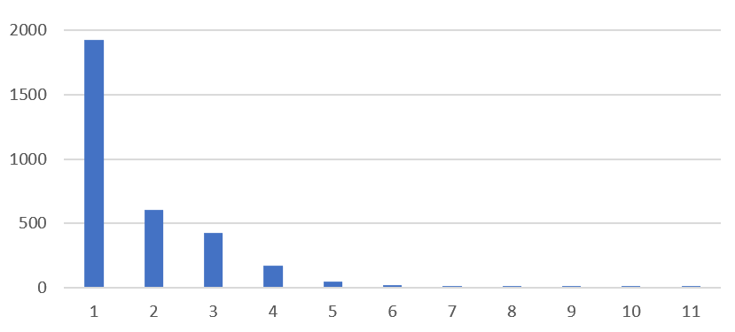

Время работы (в ms) при обработке 20 тысяч слов с точностью до 1 ms:

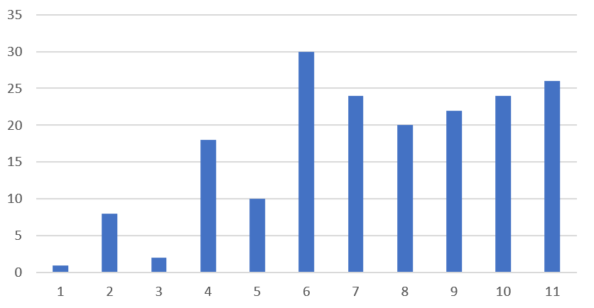

Минимальное (синий цвет) и максимальное (оранжевый цвет) количество коллизий на массиве из 107 элементов.

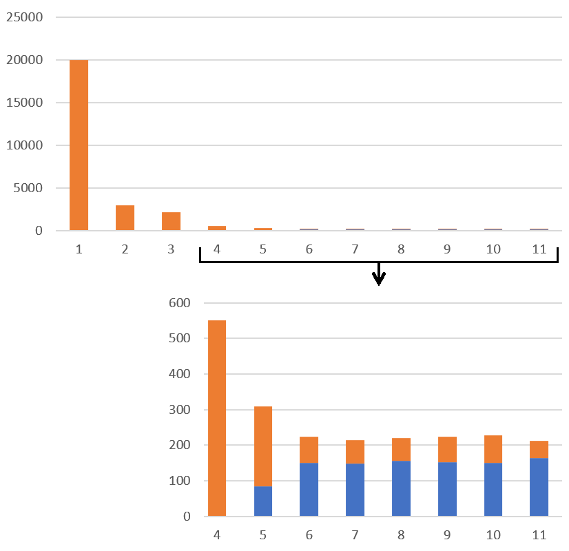

Масштабируемость:

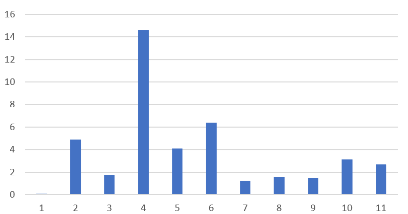

### Вывод 

Функцией из рассматриваемого списка, лучше всего подходящей для хеширования английских слов, можно назвать **DBJ2**. Несмотря на то, что мы исследовали некоторые другие функции (например, SDBM и хеш Дженкинса), обладающие схожими показателями, DBJ2 имеет наименьшее время работы среди них, что является одним из самых приоритетных критериев. Кроме того, мы можем быть уверены в стабильности данной хеш-функции благодаря низкой масштабируемости, что позволяет нам более безопасно применять ее в нашем проекте.

## Создание англо-русского переводчика

в процессе создания...

## Оптимизация

в процессе создания...

## Заключение

в процессе создания...
