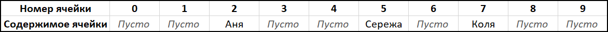

# Хеш-таблица: практическое применение и оптимизация

В этой статье мы определим что такое хеш-таблица, исследуем некоторые аспекты, связанные с ее реализацией, применим данную структуру данных для решения практической задачи и попытаемся ее оптимизировать.

## Содержание 

[тут нужно будет сделать содержание со ссылками на все ## и ### заголовки]

## Вступление

В программировании мы часто имеем необходимость хранить некоторые данные с возможностью обратиться к ним. К примеру, используя массивы, мы можем помещать в ячейки памяти некоторую информацию, которая затем доступна для прочтения при обращении к этим ячейкам по их адресам.

### Постановка простейшей задачи об именах и квартирах

Проиллюстрируем работу с массивом следующей несложной задачей. Пусть в некотором доме живут несколько ребят: Аня, Коля и Сережа. Семьи каждого из них имеют свои квартиры, у которых есть целочисленные положительные номера. Допустим, Аня живет в квартире №2, Коля - в квартире №7 и Сережа - квартире №5. В остальных квартирах живут незнаковые нам люди. Мы хотим иметь возможность по номеру квартиры узнать, кто там живет.

Для решения этой задачи мы можем завести массив строк, в N-ой ячейке которого будет храниться имя ребенка, который живет в квартире с номером N. Визуально структуру такого массива можно будет представить следующим образом:

Теперь, если мы хотим узнать, кто живет в какой-нибудь квартире, нам достаточно взять строку из ячейки с номером, равным номеру интересующей нас квартиры. В этой строке будет либо имя проживающего в ней,  либо она будет пустой, если в выбранной квартире живут незнакомцы.

Таким образом, построенный нами массив имеет информацию о парах *(номер квартиры - имя)* - зная первое, мы легко можем узнать второе. В общем случае в информатике такие пары имеют вид *(ключ - значение)*, где ключ - некоторый уникальный идентификатор, а значение - связанные с этим идентификатором данные. 

### Создание хеш-таблицы для решения задачи в обратную сторону

Но можно ли решить поставленную задачу в обратную сторону: построить такой массив, с помощью которого мы сможем по имени узнавать, в какой квартире он или она живет?

В данном случае мы сталкиваемся с проблемой: имена ребят нельзя использовать в качестве номеров ячеек массива, так как они являются наборами букв, а не натуральными числами. Однако мы можем использовать в качестве номеров ячеек не сами имена, а некоторую информацию о них, например, количество букв в каждом имени.

Давайте напишем функцию (назовем ее *hash*), которая принимает в качестве аргумента строку, а возвращает ее длину (например, *hash("Привет") = 6*). Теперь, если мы хотим узнать, где живет человек с некоторым именем *name*, мы вызовем *hash(name)* и полученное значение будем использовать как номер ячейки, в котором лежит номер квартиры человека с именем *name*. Теперь наш массив будет выглядеть следующем образом:

Таким образом, мы получили структуру данных, называемую **хеш-таблицей**. Она позволяет нам эффективно (то есть без необходимости полного перебора всего объема данных) получать некоторое значение (в данном случае номер квартиры) по ключу (в данном случае по имени). Функция *hash* в свою очередь называется **хеш-функцией**. Любая такая функция преобразует набор данных (в данном случае строку из букв) в некоторое конечное значение (в данном случае в натуральное число равное длине строки).

### Возникновение коллизий и их разрешение методом цепочек

Предположим, что мы познакомились еще с тремя ребятами. Их зовут Вова, Саша и Маша, а живут они в 6, 9 и 1 квартирах соответственно. Мы хотим добавить информацию о них в нашу хеш-таблицу, но есть одна проблема: длина имен Коли, Вовы, Саши и Машы равны, вследствие чего *hash("Коля")=hash("Вова")=hash("Саша ")=hash("Маша")=4*. Ситуации, когда хеш-функция выдает одно и то же значение при обработке разных ключей, называется **коллизия**.

Поскольку мы не можем положить более одного значения в одну ячейку массива, мы должны придумать способ разрешать коллизии. Существует много различных методов для решения этой задачи, но мы остановимся лишь на одном из них: разрешение коллизий с помощью **метода цепочек**.

Идея данного решения заключается в том, что вместо отдельных значений мы можем класть в ячейки массива набор пар *(ключ-значение)*. Набор может быть реализован разными способами, в том числе в виде обычного [связного списка](https://ru.wikipedia.org/wiki/%D0%A1%D0%B2%D1%8F%D0%B7%D0%BD%D1%8B%D0%B9_%D1%81%D0%BF%D0%B8%D1%81%D0%BE%D0%BA "Связный список (Википедия)"). После добавления новых имен в нашу хеш-таблицу с использованием списков, ее можно будет схематически представить следующим образом:

В качестве иллюстрации работы с такой структурой опишем последовательность действий, которая необходима чтобы узнать номер квартиры, в которой проживает, например, Маша:

1. Вызываем *hash("Маша")*, берем полученное значение (оно будет равно четырем), и рассматриваем соответственную ячейку массива (под номером четыре).
2. В четвертой ячейке находится список из нескольких пар *(ключ-значение)*. Начинаем их перебирать, пока не дойдем до пары, в которой ключем является "Маша".
3. Найдя пару с ключем "Маша", берем его значение. Им оказывается единица.

Таким образом мы получили информацию о том, что Маша живет в квартире №1.

### Как улучшить хеш-таблицу

Как вы наверное заметили, данные в хеш-таблице распределены неравномерно: пока одни ячейки пустуют, в других появляются значительные коллизии. В данном случае это связано в первую очередь с неудачным выбором хеш-функции, ведь многие имена имеют длины, принадлежащие узкому диапазону значений. Было бы значительно лучше, если бы при обработки имени учитывалось не только его имя, но и информация о буквах в нем, их расположение и т. д.

Но какую именно хеш-функцию лучше всего выбрать? Ответом на этот вопрос является исследование, которое будет подробно описано в следующей главе.

## Исследование хеш-функций

Целью данного исследования является тестирование различных хеш-функций для строк, содержащих английский текст, на большом объеме данных, получение их характеристических параметров и заключение об их пригодности для использования при решении реальных практических задач на основании информации, добытой в ходе работы.

### Основные характеристики хеш-функций

Прежде всего необходимо обозначить, какие характеристики являются наиболее критическими при исследовании работоспособности хеш-функций. В данной работе наибольшее внимание будет уделено следующим показателям: 

* **Дисперсия количества коллизий при разных размерах хеш-функций**. Отражает равномерность распределения коллизий в хеш-таблице при использовании данной хеш-функции. Является наиболее приоритетным параметром.
* **Максимальное и минимальное количество коллизий в одной ячейке; средняя заселенность.** Эти параметры помогают выявить участки с неравномерным распределением элементов в хеш-таблице, которые в силу особенностей расчета дисперсии не были отражены в ее показателях.
* **Время работы хеш-функции.** Это значение является ключевым при выборе из нескольких хеш-функций, обладающих близкими значениями дисперсии и других показателей равномерности.
* **Масштабируемость.** Относительная величина, отражающая способность функции сохранять свои свойства на массивах разной длинны. 

### Методика тестирования

Каждая функция по-очереди будет протестирована на множестве из 20 тысяч английских слов, наиболее часто встречающихся в английском языке. Полученные значения хеш-функций будут использоваться для получения числа коллизий, которые будут вызваны этими функциями на массивах длинной 7, 17, 29, 41, 101, 107, 1949 и 9973 элементов. 

На основании полученных данных будут построены диаграммы для визуализации результатов исследования и сделаны содержательные выводы.

### Список исследуемых хеш-функций

### Результаты тестирования

### Вывод 

## Создание англо-русского переводчика

## Оптимизация

## Заключение

